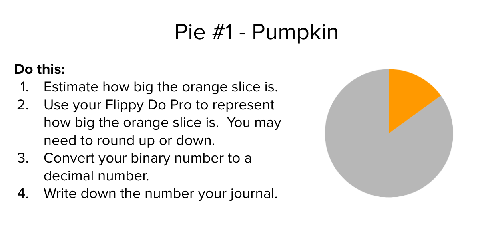
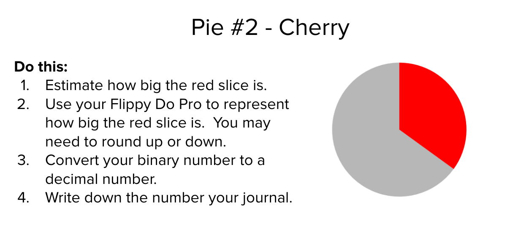
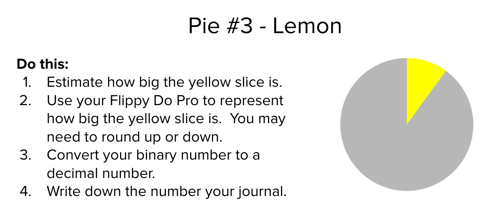
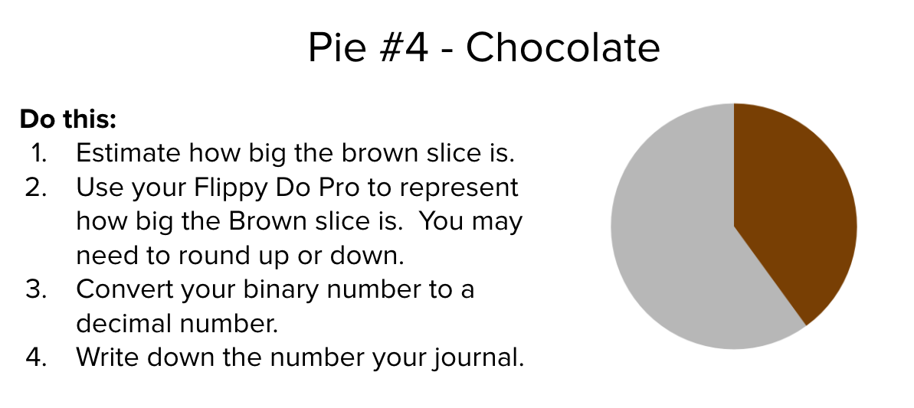

## Warm-Up

**Prompt:** Imagine you work at a local store. In the register all you have are nine $10 bills, nine $1 bills, and nine dimes.

- What’s the largest amount of change that you can give someone?
- What’s the least?
- What would you do if someone needed 7 cents in change?

## Odometer Activity

Go to [https://studio.code.org/s/csp1-2020/stage/5/puzzle/2](https://studio.code.org/s/csp1-2020/stage/5/puzzle/2).

Work with your partner to figure out how this things works.

### Challenge

**Do This:** Set the binary odometer to the highest number possible. Then let it run!

- What happens to the odometer reading?
- If this was a car, would the odometer show an accurate depiction of how far the car had been driven?

## Flippy Do Pro

### Challenge #1

Smallest Non-Zero Number: Produce the smallest non-zero binary number possible with the Flippy Do Pro.

### Challenge #2

Next Value: Increase the number made in Challenge #1 to the next possible value.

### Challenge #3

Got Quarters? Make the values 0.25, 0.50, and 0.75 one after another.

### Challenge #4

Can't Make Change: Make all the fractional possible in binary using the Flippy Do Pro.

### Challenge #5

Largest Number: What is the largest number (in decimal) you can make with the Flippy Do Pro?

### Challenge #6

## Wrap Up

Complete the 3-2-1 reflection at the end of your Week 1 Digital Journal.
